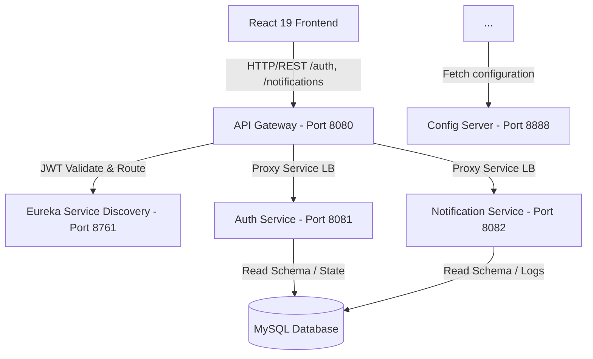

# Production-Quality Full-Stack Microservices Starter Template

An enterprise-grade, highly-configurable full-stack starter kit designed for Vendras. It contains a complete service mesh infrastructure on the backend and a modern UI on the frontend, with business logic completely decoupled to enable fast pivoting.

---

## Architecture Overview



### Backend Components
1. **Config Server (Port 8888)**: Centralized Spring Cloud Config server reading configuration profiles from classpath folders (extensible to Git).
2. **Eureka Discovery Server (Port 8761)**: Dynamic service registry for service instances.
3. **API Gateway (Port 8080)**: Intercepts all client requests, validates JWT access token claims reactively, injects user identities, and routes traffic downstream.
4. **Auth Service (Port 8081)**: Manages sign-up, sign-in, profile queries, and invalidations. Persists access tokens in-memory and refresh tokens in HttpOnly cookies.
5. **Notification Service (Port 8082)**: Reusable notification dispatch hub (EMAIL, SMS, PUSH placeholders) and delivery logs recorder, with Kafka templates ready.
6. **Common Library**: Shared Maven jar packaging DTO structures, centralized REST advice handlers, custom exceptions, JWT cryptography utility helpers, and structured latency logging filters.

### Frontend Components
* **React 19 + Vite (Port 3000)**: Clean, high-performance web dashboard built using Material UI v6 styling, Redux Toolkit state, Formik + Yup schema validations, and Framer Motion animations.
* **Axios API layer**: Built-in request/response interceptors to automatically bind Bearer tokens, capture `401 Unauthorized` responses, and perform token refreshing.

---

## Quick Start (Run with Docker Compose)

To spin up the entire application stack including the MySQL databases, run:

1. **Compile Backend Services**:
   ```bash
   mvn clean package -DskipTests
   ```

2. **Boot up Services via Docker Compose**:
   ```bash
   docker-compose up --build
   ```

3. **Access Services**:
   * **React Console**: [http://localhost:3000](http://localhost:3000)
   * **API Gateway Router**: [http://localhost:8080](http://localhost:8080)
   * **Eureka Registry Console**: [http://localhost:8761](http://localhost:8761)
   * **Config Server JSON Endpoint**: [http://localhost:8888/auth-service/default](http://localhost:8888/auth-service/default)
   * **Auth OpenAPI Docs**: [http://localhost:8081/swagger-ui.html](http://localhost:8081/swagger-ui.html)
   * **Notification OpenAPI Docs**: [http://localhost:8082/swagger-ui.html](http://localhost:8082/swagger-ui.html)

4. **Default Credentials**:
   * **Standard Account**: `user` / `password123`
   * **Administrator Account**: `admin` / `password123`

---

## Running Locally (Without Docker)

Each microservice contains a `.env` file with configuration variables mapping to `localhost` services. To run the Spring Boot applications directly on your host machine:

### 1. Set up Databases
Ensure a local MySQL instance is running on port `3306`. The microservices will automatically create their respective databases (`auth_db` and `notification_db`) on startup using the `createDatabaseIfNotExist=true` parameter in their JDBC connection URLs.

### 2. Export `.env` Variables
You must load the `.env` parameters into your shell before starting the applications.

*   **In Git Bash (Windows/Linux/macOS)**:
    Navigate to the service directory and run:
    ```bash
    export $(grep -v '^#' .env | xargs)
    mvn spring-boot:run
    ```
*   **In PowerShell (Windows)**:
    Navigate to the service directory and run:
    ```powershell
    Get-Content .env | ForEach-Object {
        if ($_ -notmatch '^\s*#' -and $_ -like '*=*') {
            $name, $value = $_ -split '=', 2
            [System.Environment]::SetEnvironmentVariable($name.Trim(), $value.Trim(), [System.EnvironmentVariableTarget]::Process)
        }
    }
    mvn spring-boot:run
    ```
*   **In IDEs (IntelliJ IDEA / Eclipse / VS Code)**:
    Install an environment loader plugin (such as the **EnvFile** plugin for IntelliJ) and configure it to read the local `.env` file in the Run/Debug Configurations panel.

### 3. Startup Order
To ensure service dependencies register properly, start the services in this order:
1. `config-server` (Port 8888)
2. `discovery-server` (Port 8761)
3. `auth-service` (Port 8081) & `notification-service` (Port 8082)
4. `api-gateway` (Port 8080)

---

## Step-by-Step: Adding a New Service (e.g., Product Service)

During a Vendra, you can spin up a new service in under 5 minutes:

### 1. Create a New Maven Module
Create a folder `product-service` and add a `pom.xml`:
```xml
<parent>
    <groupId>com.pinnacle.vendra</groupId>
    <artifactId>vendra</artifactId>
    <version>1.0.0-SNAPSHOT</version>
    <relativePath>../pom.xml</relativePath>
</parent>
<artifactId>product-service</artifactId>
<dependencies>
    <dependency>
        <groupId>org.springframework.boot</groupId>
        <artifactId>spring-boot-starter-web</artifactId>
    </dependency>
    <dependency>
        <groupId>org.springframework.boot</groupId>
        <artifactId>spring-boot-starter-data-jpa</artifactId>
    </dependency>
    <dependency>
        <groupId>com.pinnacle.vendra</groupId>
        <artifactId>common-library</artifactId>
    </dependency>
    <dependency>
        <groupId>org.springframework.cloud</groupId>
        <artifactId>spring-cloud-starter-netflix-eureka-client</artifactId>
    </dependency>
    <dependency>
        <groupId>org.springframework.cloud</groupId>
        <artifactId>spring-cloud-starter-config</artifactId>
    </dependency>
</dependencies>
```
Update `<modules>` in the parent `/pom.xml` to include `<module>product-service</module>`.

### 2. Configure Local Registry Settings
Create `product-service/src/main/resources/application.yml`:
```yaml
spring:
  application:
    name: product-service
  config:
    import: "optional:configserver:${CONFIG_SERVER_URL:http://localhost:8888}"
```

### 3. Create Shared Configurations
Create `config-server/src/main/resources/shared/product-service.yml` to specify port, database schemas, and documentation:
```yaml
server:
  port: 8083

spring:
  datasource:
    url: jdbc:mysql://${DB_HOST:localhost}:${DB_PORT:3306}/vendra_db
  jpa:
    hibernate:
      ddl-auto: update
```

### 4. Register Gateway Routing Rules
Open `config-server/src/main/resources/shared/api-gateway.yml` and add a new route entry:
```yaml
      routes:
        ...
        - id: product-service
          uri: lb://product-service
          predicates:
            - Path=/products/**
          filters:
            - StripPrefix=0
```

### 5. Add Main Application class
Create `ProductServiceApplication.java` under package `com.pinnacle.vendra.product`:
```java
package com.pinnacle.vendra.product;

import org.springframework.boot.SpringApplication;
import org.springframework.boot.autoconfigure.SpringBootApplication;
import org.springframework.cloud.client.discovery.EnableDiscoveryClient;

@SpringBootApplication(scanBasePackages = {"com.pinnacle.vendra.product", "com.pinnacle.vendra.common"})
@EnableDiscoveryClient
public class ProductServiceApplication {
    public static void main(String[] args) {
        SpringApplication.run(ProductServiceApplication.class, args);
    }
}
```

### 6. Add REST Endpoints & Read Headers
Inject user data (username, roles) passed by the API Gateway:
```java
@GetMapping("/my-products")
public ResponseEntity<?> getProducts(@RequestHeader("X-User-Name") String username, 
                                     @RequestHeader("X-User-Roles") String roles) {
    // Business Logic
}
```

### 7. Consume API on the Frontend
Create `frontend/src/services/productService.js`:
```javascript
import api from './api';

export const getProducts = async () => {
  const response = await api.get('/products/my-products');
  return response.data.data;
};
```
Use it inside your React components with React hooks or Redux dispatch thunks!
